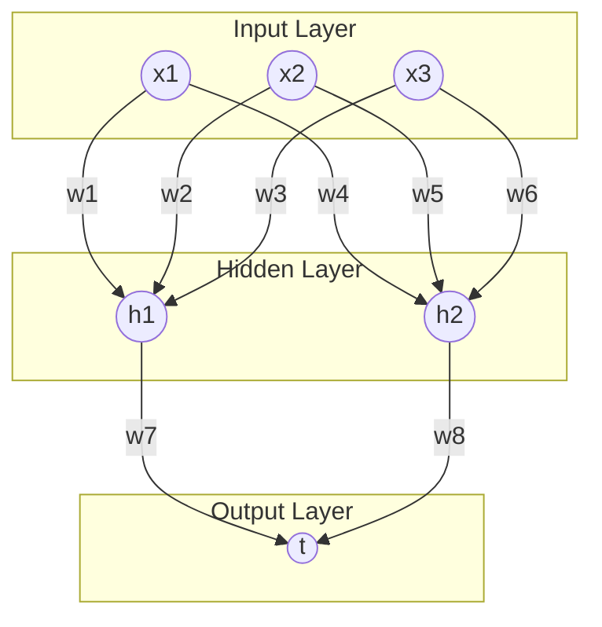

```mermaid
graph TD
    subgraph Input Layer
        X1((x1))
        X2((x2))
        X3((x3))
    end

    subgraph Hidden Layer
        H1((h1))
        H2((h2))
    end

    subgraph Output Layer
        T((t))
    end

    X1 -->|w1| H1
    X2 -->|w2| H1
    X3 -->|w3| H1

    X1 -->|w4| H2
    X2 -->|w5| H2
    X3 -->|w6| H2

    H1 -->|w7| T
    H2 -->|w8| T
```